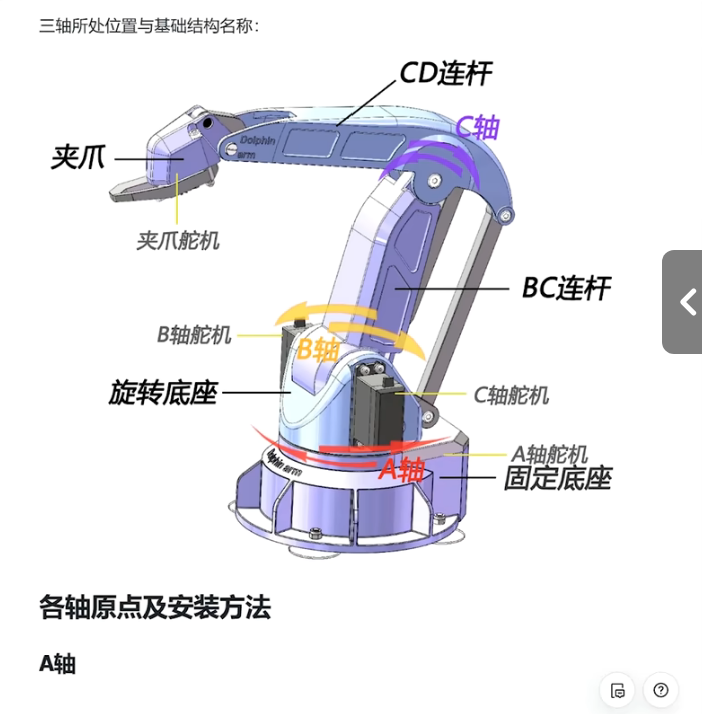
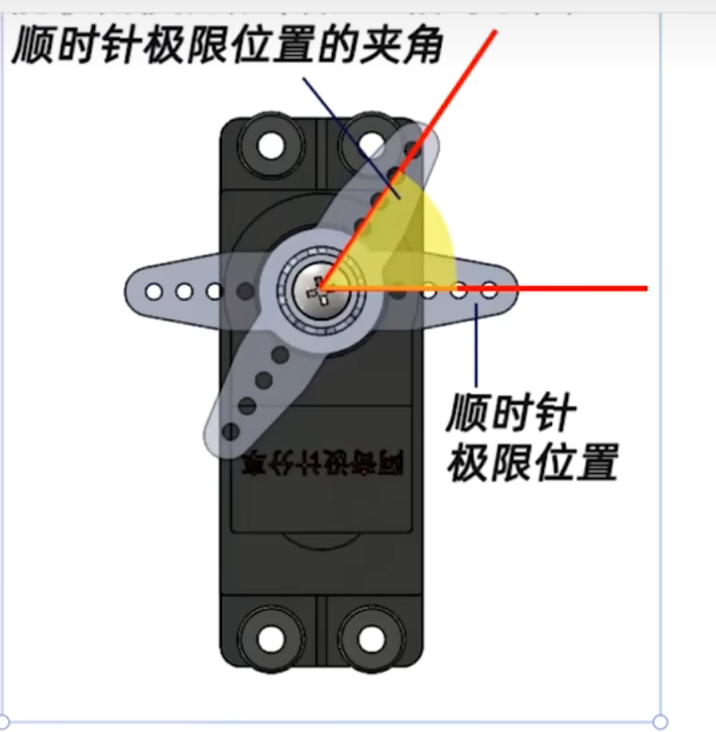
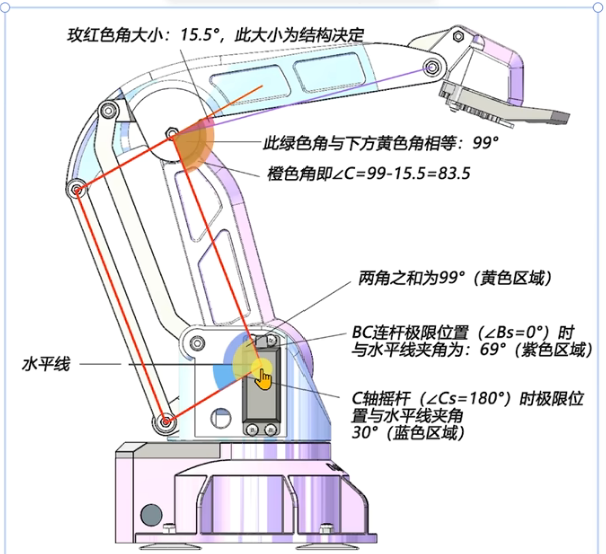

| IO口   | 作用     | 引脚     |
| ------ | -------- | -------- |
|        | 四个舵机 |          |
| PA6    | TIM3_CH1 |          |
| PA7    | CH2      |          |
| PB0`   | CH3      |          |
| PB1    | CH4      |          |
|        |          |          |
| 串口一 |          |          |
| PA9    | U1-TX    | 蓝牙的RX |
| PA10   | U1-RX    | 蓝牙的TX |
|        |          |          |
|        |          |          |
|        |          |          |
| 串口2  |          |          |
| PA2    | U2-TX    | 蓝牙的RX |
| PA3    | U2-RX    | 蓝牙的TX |
|        |          |          |
|        |          |          |
| IIC——1 |          |          |
| B6     | SCL      |          |
| B7     | SDA      |          |
|        |          |          |
| A0     | 开关     |          |
|        |          |          |
| A1     | LED      |          |
| A4     | LED      |          |
| A5     | LED      |          |

## 配件

- 面包板
- stm
- 四个舵机
- 若干杜邦线
- 蓝牙？

## 参数

1. 坐标系

   1. 原点位于旋转中心的底部位置

2. 夹爪点

   1. 夹爪手指中间的点靠近夹爪的最低位置

3. 夹爪点到支点的距离

   1. 垂直
   2. 水平

4. 各个轴的角度：当时位置与其极限位置之间的夹角

   1. 3. 

   2. A轴  因为控制A轴的舵机是垂直放置的，所以
   
      1. 小同步带轮，大同步带轮
      2. 舵机0-180----->A轴0-70
   3. 定义中间旋转90°为原点，那么顺时针极限位置就是舵机转90°
   
3. C轴
   
      
   
   1. 定义舵机位置：相对于向前旋转的极限位置的夹角，记作Cs
      2. C轴舵机为原点——向后极限位置时，角度为180°
      1. 此时与水平的夹角为 aerfa
      3. 平行四边形的角与真正角C的差角，记作γ

5. 每个旋转中心之间的连线长度

6. A轴旋转中心与坐标原点中心的距离

7. A轴旋转中心与地面的高度

8. 三个轴向顺逆的旋转极限位置

## 路径规划

1. 我确定一个初始位置，一个合适的初始位置，记作（a0,b0,c0）
2. 然后收到物体的（x，y）坐标
3. 然后先移动A轴，再移动C轴，最后B轴
4. 夹取
5. 识别，分类，设定新的目标点
6. 然后回到一个居中的位置
7. 移动到新的目标点（A轴，C轴，B轴）
8. 归位

- 我需要设定一个点，作为初始位置和结束位置，记作点G
- 还需要设定一个位于空间居中的点，作为抓取到物体到移动到目标位置的过渡点，记作点O（如果没有可能就会碰到别的物体）
- 每个状态设定一个标志位

## 角度初始化

1. A轴：90°
2. B轴：
3. C轴：180°对应的舵机角度为180°（从后往前看舵机顺时针到极限位置为舵机的真实值180°）

## 角度限制

- C轴：限制角度为120~180
- B轴：84
- A轴：限制角度为0~180

## 识别

- 红色：C
- 黄色：A

## 移动顺序

- 夹取物块的时候移动的顺序
- 移动至放置区域时的顺序
- 从放置区域移动至原始位置的顺序

## 遇到的问题

- 单位的考虑
- 运动解算出问题

## 坐标

- 复位（0，230，126.31）
- 极限
  - 最近
    - （0，0，116.23）
  - 最远
    - （0，0，224.78）
- 随便一个
  - （）
