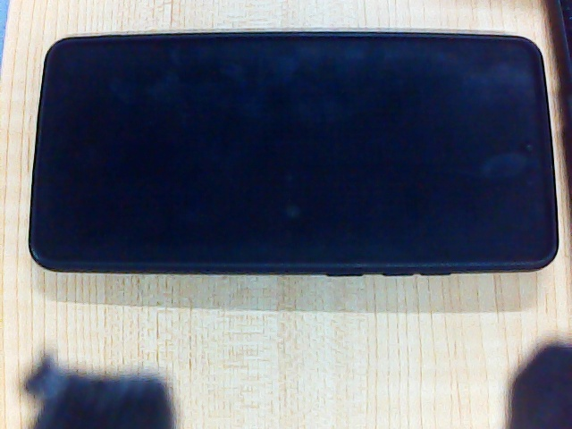

<center><font size=6 color='HotPink'>机械臂！上位机！实现思路与教程！</font></center>

# 一、系统配置部分
## 1.1 前言
使用的上位机是地瓜机器人的RDKx5
## 1.2 系统烧录
[官方烧录教程](https://developer.d-robotics.cc/rdk_doc/Quick_start/install_os/rdk_x5)
- **注意事项：**
    1. 烧录工具：使用refus进行烧录(下载地址：https://rufus.ie/zh/)下载标准版即可，下载下来的.exe文件即为软件本体。
    2. 烧录的镜像文件看清楚，一定要是 **.img** 格式！！！刚下载下来的是压缩包，需要解压！！！
    3. 一定要看官方教程里的注意事项！！！
## 1.3 入门配置
[官方配置教程](https://developer.d-robotics.cc/rdk_doc/Quick_start/configuration_wizard)
- **注意事项**
    1. RDK Studio 目前使用体验不是很好且没有必要，不用管它
    2. RDK板子上的那个按钮基础功能仅用于闪连的配置，其他时候按了没用
## 1.4 远程登录
[官方配置教程](https://developer.d-robotics.cc/rdk_doc/Quick_start/remote_login)
我使用的是SSH登录
- **注意事项**
  1. 命令行登录的语法：`ssh 用户名@板子ip地址`
  2. 如果使用的是个人热点，可能在不久之后你会碰到*突然连不上板子的情况*。但是！不要慌！这可能是你更改了手机热点的部分设置导致ip地址有变化，这时只需进入设备设置页更改ip地址就行。
    - **MobaXterm**：右键设备 >> Edit Session >> Remote host 处更改
    - **VScode**：点击左下角蓝色按钮(打开远程窗口) >> 连接到主机 >> 配置SSH主机 >> 选择你要配置的SSH配置文件(不知道怎么选就选第一个) >> 进入config文件中，将Host一行的ip地址改为现在板子所在的ip地址
  3. 不会看板子ip地址怎么办？
     1. 板子已连接手机热点情况：下拉手机控制中心，长按"个人热点"，点击已连接设备，这时可以找到名为Ubuntu的设备，下面就是它的ip地址
     2. 板子未连接手机情况：用串口登录上板子或者直接将板子连上显示器并打开终端，输入`ifconfig`即可找到板子的iPv4地址
- **进阶操作**
  - 是否还在为每次登录都要输两遍密码而烦恼？想不想快速跳过繁杂的流程直接回到上次编辑页面？SSH免密登录它来了！
  1. 使用本地端(PC)创建秘钥：
        1. 在电脑的cmd上输入`ssh-keygen -t rsa`，然后进入文件夹`C:\Users\username\.ssh`(username是你自己的用户名)会生成一个公钥文件(id_rsa.pub)和一个私钥文件(id_rsa)
        
        2. 上传公钥：
           1. 自动上传公钥：
           本地cmd输入`ssh-copy-id username@ip`
           2. 手动上传：
              - 进入板子里的.ssh文件夹(在/home/users/username/)下，没有可以创建一个。
              - 进入该文件夹
              - 上传文件：id_rsa.pub
              - 手动将id_rsa.pub的内容追加到authorized_keys中
  2. 重启服务：`sudo service sshd restart`
  之后就能免密登录上我们的板子了 :)
## 1.5 下载miniconda环境
1. 找到一个下载源（国内源：https://mirrors.tuna.tsinghua.edu.cn/anaconda/miniconda/）
2. 找到一个版本进行下载(如：Miniconda3-py310_23.1.0-1-Linux-aarch64.sh)
    **注意！下载的版本为python、aarch64版本，否则会安装失败！**
3. 在conda的下载目录中输入：`bash Miniconda3-py310_23.1.0-1-Linux-aarch64.sh`
    然后一直回车，碰到yes输yes，直到安装完成
4. 设置环境变量
在/etc/profile 和 /home/users/username/.bashrc的末尾都添加：`export PATH=~/miniconda3/bin:$PATH`，其中路径为你安装的miniconda的bin文件夹的了路径
5. 刷新环境变量
  ```shell
  source /etc/profile
  source ~/.bashrc
  ```
6. 使用conda创建新环境吧！

# 二、视觉部分
## 1.1 任务明确
我们的目标是识别出一个正方体物块(指定颜色)，并获取到它的中心的位置坐标
所以，我们有三个任务：
- 提取出对应方块的颜色
- 识别出提取图像中的正方体
- 计算正方体的位姿并估计坐标(位姿：目标物体的位置与姿态)
## 1.2 颜色提取
 最方便用来提取颜色的通道类型就是HSV了，通过设定图片的HSV阈值来提取颜色
 ```python
 # 这是我们使用的两种颜色的物块的HSV阈值
 green = [[50, 100], [150, 255], [120, 255]]
 orange = [[0, 18] , [100, 255], [214, 255]]
 def get_color(BGRimg, hsv_range):
    hsv = cv2.cvtColor(BGRimg, cv2.COLOR_BGR2HSV) # 通道转换
    h, s, v = cv2.split(hsv)
    hmin, hmax = hsv_range[0]
    smin, smax = hsv_range[1]
    vmin, vmax = hsv_range[2]
    huemask = cv2.inRange(h, hmin, hmax)
    satmask = cv2.inRange(s, smin, smax)
    valmask = cv2.inRange(v, vmin, vmax)
    mask = huemask & satmask & valmask # 将三个通道的掩模合并为一个
    rst = cv2.bitwise_and(hsv, hsv, mask=mask) # 两个相同图片按位与的结果等于原图，重点在掩模
    rst = cv2.cvtColor(rst, cv2.COLOR_HSV2BGR) # 转换回BGR通道
    return rst
 ```
  为了方便之后的识别，在经过一系列试错后，我发现最合适的提取范围就是提取出正方体的顶面。(而不是整个)
  [具体原因之后会说到](#13n-试过的多种方法)

  |||
  |:--------:|:--------:|
  |原图|提取后图像|
## 1.3 正方体识别
### 1.3.1 相机标定
#### 1. 效果
每一个相机都会因为物理原因而有各种各样的畸变(或者叫失真)，这时候就需要通过**相机标定**求出摄像头的**内参矩阵和畸变矩阵**来矫正这种镜头畸变，生成矫正后的图像，这样我们从图像中得到的位姿信息才准确


  <table><tr>
  <td></img></td>
  <td></img></td></tr>
  <tr>
  <td align="center">矫正前</td>
  <td align="center">矫正后</td></tr>
  <tr><td colspan=2 align="center">很明显，矫正前的图像的直边有一点弯曲，校正后就跟人眼观察相同了</td></tr>
  </table>

#### 2. 步骤(张正友棋盘格标定法)
**I. 采集标定所需要的棋盘格图像**
  - 要求：15~20张，多种角度
    
    <p><center><font color="gray">我采集的样本图片</font></center></p>
**II、求相机的内参矩阵和畸变矩阵**
> 由于笔者的数学能力有限，读不懂图像通过内参矩阵和畸变矩阵变换的数学原理，如有需要，请参阅CSDN教程：[【一文弄懂】张正友标定法-完整学习笔记-从原理到实战](https://blog.csdn.net/hehedadaq/article/details/105763241)
1. 关键函数：`cv2.calibrateCamera`
  ```py
  retval, cameraMatrix, distCoeffs, rvecs, tvecs = cv2.calibrateCamera(objectPoints, imagePoints, imageSize, cameraMatrix, distCoeffs, rvecs, tvecs, flags, criteria)
  ```
  参数含义：
  - **objectpoints**:  一个包含每个棋盘格图像的物理角点坐标的列表，通常是由棋盘格的尺寸和方块的实际尺寸计算得到的三维坐标。类型是 `List[np.ndarray]`
  - **imagePoints**: 包含每个棋盘格图像上检测到的对应角点的图像坐标的列表。类型是 `List[np.ndarray]`
  - **imageSize**: 图像的尺寸，通常是一个 (width, height) 的元组
  - **distCoeffs**: 相机的畸变系数，可以作为输入的初始估计值，也可以为空，由函数自动生成
  - **rvecs** 和 **tvecs**: 旋转向量和平移向量，可以作为输入的初始估计值，也可以为空，由函数自动生成
  - **flags**: 标志参数，用于指定一些标志，例如 cv2.CALIB_USE_INTRINSIC_GUESS 表示使用输入的 cameraMatrix 作为初始猜测值
  - **criteria**: 停止迭代的条件，通常使用 cv2.TermCriteria 类型，表示迭代停止的条件，可以包含最大迭代次数、精度等
  
  返回值含义:
  - **retval**: 标定的重投影误差。越小表示标定效果越好
  - **cameraMatrix**: 相机内部参数矩阵
  - **distCoeffs**: 相机的畸变系数
  - **rvecs**: 旋转向量的列表
  - **tvecs**: 平移向量的列表
### 1.3.n 试过的多种方法
# 三、串口通信部分