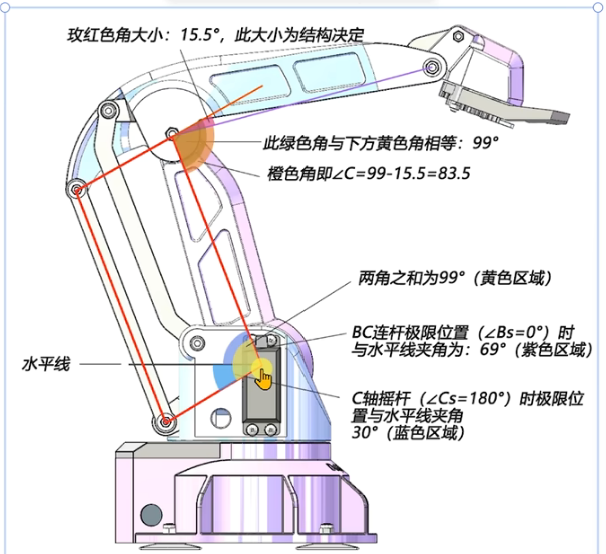

# 				海豚机械臂解算

对于一个机械臂，我们想让他移动，那么就会输出舵机角度（angel），如果我们要实现想让他停在哪就停在哪，那么我们就需要控制输出的舵机角度实现机械臂夹爪指向指定的空间中的点——因此我们就需要实现知道角度推出空间位置——知道空间位置推出角度————这就是所谓机械臂正逆解算——知道角度推出空间位置为正解算—知道空间位置推角度为逆解算

我们依次讲解其解算

## 机械臂解算

- 已知：机械臂的ABC角度
- 未知：机械臂的空间位置

首先我们应该引入一个坐标系，不然我们没有办法确定夹爪在空间中的精确的位置，我们选择其机械臂底盘的中点作为坐标原点

我们可以构建一个简化的模型：

如图

其推导公式为
$$
\because \quad
\begin{cases} 
x^{'}= L1 \cdot \sin{(C-B)}+L2\cdot \sin{B}
\\ 
y=h+L2\cdot{\cos{B}}-L1\cdot{\cos{(C-B)}}
\\
x=x^{'}\cdot{\sin{A}}
\\
z=x^{'}\cdot{\cos{A}}
\end{cases}
\\
\therefore

\begin{cases}
x=\left[L1 \cdot \sin{(C-B)}+L2\cdot \sin{B}\right]\cdot{\sin{A}}
\\
z=\left[L1 \cdot \sin{(C-B)}+L2\cdot \sin{B}\right]\cdot{\cos{A}}
\\
y=h+L2\cdot{\cos{B}}-L1\cdot{\cos{(C-B)}}
\end{cases}
$$

机械臂的逆运算就是这个的已知条件和未知条件换过来。

这是一个极其简单的模型。接下来我们讨论更加复杂的模型

## 海豚机械臂

上图是一个海豚机械臂的模型示意图

三个舵机都在底盘，通过机械结构驱动遥杆，连杆的运动

各轴定义上图有表示，不必多说

### 解算

我们先定义一个坐标系——以机械臂底盘中心为原点，竖直向上为Y轴，水平竖直向前为Z轴，水平向两侧为X轴

然后我们再定义我们使用的角度（不是舵机实际角度）

B轴角度定义方式：

1. 向后的极限位置对应的舵机角度为0°（远离地面的方向）
   1. 向后的极限位置与水平线的夹角，记作beita
2. 向前增大
3. 最大角度对应的舵机角度

1. A轴  因为控制A轴的舵机是垂直放置的，所以

   1. 小同步带轮，大同步带轮
   2. 舵机0-180----->A轴0-70
   3. 定义中间旋转90°为原点，那么顺时针极限位置就是舵机转90°

   1. 1. C轴

         

         1. 定义舵机位置：相对于向前旋转的极限位置的夹角，记作Cs
         2. C轴舵机为原点——向后极限位置时，角度为180°
            1. 此时与水平的夹角为 aerfa
         3. 平行四边形的角与真正角C的差角，记作γ

定义好角度之后通过类似的数学知识就可以通过夹爪的xyz推算出ABC轴的角度

